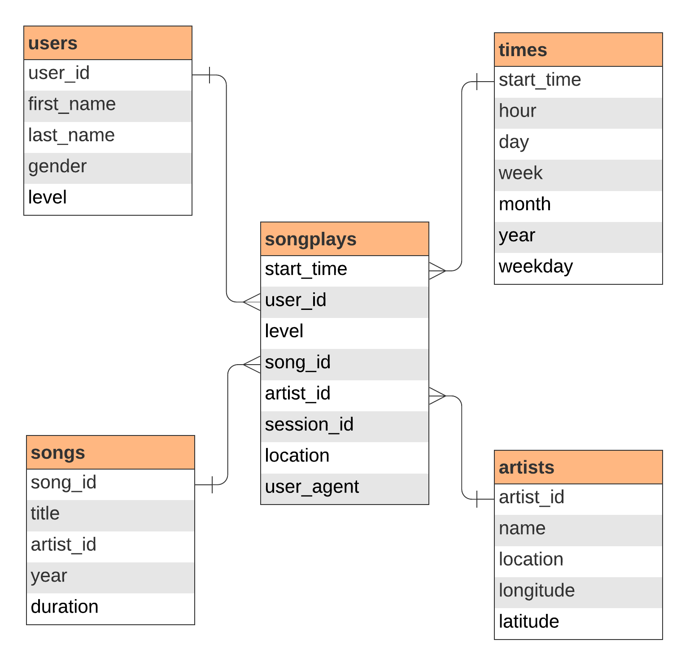

# Data Warehousing with Redshift

This project models song streaming data for warehousing in Amazon Redshift. There are two datasets, each initially stored in Amazon S3 buckets in JSON format: song data and log data. 

I want to model these two datasets as a star schema to store on a Redshift cluster. I then want to create an ETL pipeline that takes the data from the S3 buckets, stages it in Redshift, and then transforms it in conformity with the schema. This will accomplish three things:

1. It will logically connect both datasets so user data is related to song data through fact and dimension tables. This will allow for the tracking of user activity.

2. It will allow for horizontal scalability of the data.

3. It will provide MPP (massive parallel processing), which parallelizes the execution of a single queries. 

## Database Schema

## Project Organization

This process can be replicated by running the below two scripts:

- <b>create_tables.py</b>: This script connects to the Redshift cluster and creates the fact table and four dimension tables via the <b>sql_queries.py</b> file.
- <b>etl.py</b>: This script connects to the cluster, extracts and copies the two datasets from the S3 buckets into staging tables, and transfoms and loads the data into the cluster according to the schema—also via the <b>sql_queries.py</b> file.

Redshift's Query Editor can be used to query the data.